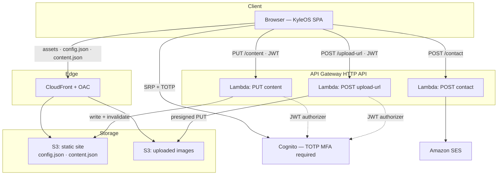

# KyleOS — Design Document

Living document. Update it when decisions change. Stale docs are worse than no docs.

---

## 1. What we are building

A personal portfolio for Kyle Bush reimagined as a tiny operating system.

- **Desktop (>820px):** windowed desktop environment — draggable app windows with traffic-light controls, a dock, a working menu bar, a boot sequence, and Spotlight (⌘K) fuzzy search.
- **Mobile/tablet (≤820px):** iPhone-style springboard — 4-col app grid, floating bottom dock, full-screen app sheets, back-chevron navigation. One app open at a time.
- **Themes:** light and dark, driven entirely by CSS custom properties.
- **Hidden admin:** an authenticated content editor that lets Kyle edit every word on the site without a deploy.

**This repository is public and is itself a portfolio piece.** The code is part of the work. See §2.

---

## 2. Prime directive: the code is the product

This repo will be read by engineers evaluating Kyle. It is not enough for it to work.

**Every line must earn its place.** Simple, elegant, minimal, well-documented, readable by a human on first pass with no walkthrough. No cleverness for its own sake. No dead code. No speculative abstraction. No framework-of-the-week. If a simpler thing does the job, the simpler thing wins.

**This is a review gate, not an aspiration.** The Code Reviewer checks it at the end of every phase against `docs/REVIEW_GATE.md`. A phase is not done until it passes.

Two consequences that shape the entire architecture:

1. **Nothing environment-specific is hardcoded.** No account IDs, ARNs, bucket names, pool IDs, endpoints, or domains anywhere in version control. A stranger clones the repo, sets their own variables, runs `terraform apply`, and gets their own KyleOS. See ADR-006.
2. **No personal content in the repo.** It ships a generic template. Kyle's actual bio and projects live in S3, not git. See ADR-002.

---

## 3. The design spec

The complete visual and behavioral spec is the prototype in `reference/`:

| File | What it is |
|---|---|
| `reference/KyleOS.dc.html` | **The spec.** A working, high-fidelity prototype, authored in Claude Design. |
| `reference/image-slot.js` | The drag-and-drop image-slot component from the prototype. Reference only — **not shipped**. See ADR-008. |
| `reference/HANDOFF.md` | The designer's own notes: tokens, chrome, screens, behavior. |

**Treat these as the spec. Re-implement; do not transpile.** The prototype runs on a bespoke runtime (`<x-dc>`, `sc-for`, `sc-if`, `class Component extends DCLogic`) that does not exist in this codebase.

**Fidelity is high and non-negotiable.** Colors, typography, spacing, radii, shadows, animation curves, easing, timings, copy, and interactions are all final and intentional. The finished site must look and interact *exactly* as the prototype does. Open `KyleOS.dc.html` in a browser and compare side-by-side at the end of every phase — that comparison is part of the review gate.

The prototype's inline styles are a constraint of the prototyping runtime, **not** a design decision. Lift them into CSS variables and Tailwind.

---

## 4. Goals and non-goals

**Goals**
- Pixel-faithful recreation of the prototype in a production React codebase.
- Code clean enough to be a portfolio piece in its own right.
- Content editable at runtime by an authenticated owner. No deploy to change a word.
- Real authentication using Cognito's built-in TOTP MFA. No security theater.
- Forkable: anyone can deploy their own instance with their own config.
- Near-zero running cost.
- Fully automated CI/CD.

**Non-goals**
- Multi-user support. There is exactly one admin: Kyle.
- A CMS. The content model is one JSON document and stays that way.
- Server-side rendering. See ADR-001.
- Comments, analytics dashboards, or a blog engine. Writing links out.

---

## 5. Architecture decisions

### ADR-001 — Vite SPA, not Next.js

**Decision:** Vite 6 + React 19 SPA, deployed as static assets to S3 behind CloudFront.

**Rejected:** Next.js (SSR), Next.js (static export).

**Reasoning:** KyleOS is an application shell, not a content site. It is `height:100vh; overflow:hidden` behind a 1.5s boot overlay, with a stateful window manager as the primary UI. Server rendering produces a boot screen — there is nothing meaningful to pre-render. Next.js's strongest draw here would be co-located API routes, but that conflicts with the AWS-native backend; adopting it would mean running a Node server on Lambda purely to proxy to other Lambdas. It would also add a framework's worth of surface area to a repo whose selling point is that it has none.

**Tradeoff accepted:** crawlers and social unfurlers see an empty root div. Mitigated in `index.html` with static `<meta>`/OpenGraph tags, JSON-LD `Person` schema, and a `<noscript>` block. Google executes JS and will index the rendered app; LinkedIn/X unfurls read the static meta tags, which are present.

---

### ADR-002 — Content is data, not code

**Decision:** The editable content document lives as `content.json` in S3. **It is never committed to the repository.** The repo ships `content.example.json` — a generic, fictional template used only to bootstrap a fresh deployment.

**Rejected:** DynamoDB. Committing real content to git. Syncing S3 content back into the repo.

**Reasoning — storage:** this is one JSON document, read on every page load and written a handful of times per month. S3 + CloudFront means the read path never invokes a Lambda and never leaves the CDN edge. DynamoDB would add a cold start to the critical read path for zero benefit at this access pattern. A deliberate, documented deviation from the usual DynamoDB default.

**Reasoning — version control:** content is edited through the admin UI at runtime. If it were *also* committed, the two would diverge the instant Kyle made his first edit, and the repo would be lying about what the site says. And because this repo is public and meant to be forkable, committing Kyle's real bio would make it a portfolio-of-Kyle rather than a template. The repo holds the *shape* of the content; never the content itself.

**Content history:** S3 object versioning is on. Every admin save creates a new version. That **is** the content's version control, with free rollback:

```bash
aws s3api list-object-versions --bucket "$SITE_BUCKET" --prefix content.json
aws s3api get-object --bucket "$SITE_BUCKET" --key content.json \
  --version-id "$VERSION_ID" restored.json
```

**Cache strategy:** `content.json` is served with `Cache-Control: max-age=60`. `PUT /content` issues a targeted CloudFront invalidation for `/content.json` so edits appear immediately.

---

### ADR-003 — Cognito's built-in TOTP MFA, with our own login UI

**Decision:** Amazon Cognito User Pool with **MFA required, TOTP only**. Authentication uses SRP plus Cognito's native `SOFTWARE_TOKEN_MFA` challenge, rendered in the app's own login UI via `amazon-cognito-identity-js`.

**We do not implement 2FA.** Cognito owns the entire MFA lifecycle: it generates the TOTP secret, associates the software token, validates the 6-digit code, enforces the challenge on every sign-in, and rate-limits and locks out on repeated failure. We render the input boxes and hand the code to Cognito. **There is no hand-rolled crypto, no TOTP library, and no secret in our code.**

**Rejected — Cognito Hosted UI / Managed Login:** zero auth code and AWS maintains it, which is genuinely attractive. But it redirects to an AWS-branded page, destroying the OS illusion at exactly the moment the design is working hardest. The prototype's login — email/password, then six auto-advancing single-character TOTP boxes — is part of the design.

**Rejected — AWS Amplify Auth:** would cut the auth code to ~40 lines, but pulls a large dependency in to solve a small problem. Fails the §2 bloat test.

**Tradeoff accepted:** we own ~150 lines of auth flow, and `amazon-cognito-identity-js` is a low-maintenance-mode library. This is a real risk, and it is a *bounded* one — see ADR-004. If the library is ever abandoned, the same flow is reachable through `@aws-sdk/client-cognito-identity-provider` with a contained rewrite behind `lib/cognito.ts`. **Keep that seam clean:** no Cognito types leak out of `lib/cognito.ts`.

Because SRP means the password is never transmitted, owning the UI costs nothing in security.

**Configuration:** self-signup **disabled**; one user, created manually. MFA **required**. TOTP only — **no SMS** (SIM-swap risk, and it costs money).

**Session handling:** tokens live **in memory only**, never in `localStorage`. A page reload requires re-authentication. For an admin used a few times a month, that is the correct trade: it eliminates a whole class of token-theft bugs and costs Kyle one extra TOTP code.

---

### ADR-004 — Break-glass: the owner can never be locked out

**The content editor is the primary interface.** It is how Kyle edits his site — every time, forever. Log in at `#admin`, change any field through a form, save, done. No deploy, no git, no terminal. It is a first-class deliverable (Phase 4), not an optional extra, and it must be as polished as the rest of the OS.

This ADR is about what happens when that interface is unavailable.

**Decision:** because content is a plain S3 object, **owner access to it does not depend on the app, the auth flow, or Cognito continuing to work.** There is always a path in.

```bash
# Fire extinguisher behind glass. Not the workflow — the guarantee.
aws s3 cp "s3://$SITE_BUCKET/content.json" .
$EDITOR content.json
aws s3 cp content.json "s3://$SITE_BUCKET/content.json" --cache-control "max-age=60"
aws cloudfront create-invalidation --distribution-id "$DIST_ID" --paths "/content.json"
```

**Reasoning:** this is the answer to "what bites me later." It is not the auth mechanism — it is that the auth mechanism is bypassable *by the owner, at the infrastructure layer*. Lost TOTP device, abandoned library, broken deploy, Cognito outage: Kyle updates his site from a terminal in thirty seconds and fixes the editor at his leisure.

**This is emergency-only. Kyle should never need it.** Storing content as a plain object rather than behind a database is precisely what makes the guarantee possible — and it costs the editor nothing.

**Requirement:** document this in `docs/RUNBOOK.md` alongside the MFA-reset procedure (`aws cognito-idp admin-set-user-mfa-preference`), and **test it once, by hand, before launch.** An untested break-glass procedure is not a break-glass procedure.

---

### ADR-005 — The API is the security boundary, not the route

**Decision:** `#admin` remains an unguarded client-side hash route. All security is enforced by a Cognito JWT authorizer on the write APIs.

**Reasoning:** a static SPA on CloudFront has no server-side route protection, and hash fragments are never sent to the server — a CloudFront Function cannot see `#admin` at all. This is fine. An anonymous visitor who navigates to `#admin` is shown a login form and nothing else. The editor cannot load, save, or upload without a valid JWT. Hiding the route is obscurity; rejecting the write is security.

**Threat model — brute force:** TOTP makes credential guessing infeasible. An attacker needs the password *and* a code that rotates every 30 seconds. Cognito rate-limits and locks out independently.

**Rejected:** IP-allowlisting the write API. Breaks editing from mobile or any network change, and adds nothing on top of TOTP.

---

### ADR-006 — Zero environment values in the repository

**Decision:** No account ID, ARN, bucket name, distribution ID, Cognito pool or client ID, API endpoint, domain, or email address appears anywhere in version control. The repo is environment-agnostic and forkable.

**How the frontend gets its config:** the app fetches **`/config.json`** at boot, before rendering. CI generates that file from Terraform outputs and uploads it alongside the build. The bundle contains no environment values at all.

```jsonc
// config.example.json — committed. The real config.json is generated at deploy time.
{
  "region":            "<aws-region>",
  "apiBaseUrl":        "https://<api-id>.execute-api.<region>.amazonaws.com",
  "cognitoUserPoolId": "<region>_<id>",
  "cognitoClientId":   "<client-id>"
}
```

These are **public values, not secrets** — a static site's bundle is readable by anyone, and Cognito IDs are designed to be public. The point is not secrecy. The point is that the repo must not be welded to one AWS account. A forker writes their own `terraform.tfvars` and deploys.

**This deliberately rules out Vite's `VITE_*` build-time env vars for infrastructure config.** Baking values into the bundle couples the build artifact to an environment and tempts someone into committing a `.env`. Runtime config costs one extra fetch and buys full separation.

| Layer | Mechanism | Committed? |
|---|---|---|
| Frontend | `/config.json`, fetched at boot | `config.example.json` only |
| Terraform inputs | `variables.tf` + `terraform.tfvars` | `terraform.tfvars.example` only |
| Terraform state backend | `-backend-config` flags from CI | ✗ |
| GitHub Actions | repo variables + secrets (`AWS_DEPLOY_ROLE_ARN`, `AWS_REGION`) | ✗ |
| Lambda | environment variables set by Terraform | ✗ |
| Content | S3 (ADR-002) | `content.example.json` only |

`.gitignore` must cover `terraform.tfvars`, `*.tfstate*`, `.env*`, `config.json`, `content.json`.

**Acceptance test — runs in CI:**

```bash
grep -rniE 'AKIA|[0-9]{12}|arn:aws|execute-api|amazonaws\.com|us-[a-z]+-[0-9]' \
  --exclude-dir={node_modules,.git,dist,reference} \
  --exclude='*.example.*' .
# must return nothing
```

---

### ADR-007 — Monorepo, Terraform, OIDC

**Decision:** one repository containing web app, API, and infrastructure. Terraform for all infrastructure — if it is not in Terraform, it does not exist. GitHub Actions authenticates via OIDC role assumption. **No long-lived AWS access keys anywhere.**

---

### ADR-008 — `image-slot.js` is reference, not a dependency

**Decision:** the prototype's drag-and-drop image-slot web component is **not shipped**. It exists to show the intended interaction: drop a file on a 16:10 slot, see it appear.

**Replacement:** the editor requests a presigned S3 URL (`POST /upload-url`), PUTs the file directly to S3, and stores the returned key in `content.projects[i].image`. Recreate the drop-target *interaction*; do not port the implementation.

---

## 6. System architecture



**Read path (every visitor):** Browser → CloudFront → S3. No Lambda, no database, no cold start. Fully edge-cached.

**Write path (Kyle only):** Browser → Cognito (SRP + TOTP) → JWT → API Gateway (JWT authorizer) → Lambda → S3 → CloudFront invalidation.

**Break-glass path (ADR-004):** Terminal → S3. No app involved.

---

## 7. Content model

One JSON document — the contract between the site, the editor, and the API. `content.example.json` is the committed template; the prototype's `defaults()` is its source.

```typescript
interface Content {
  hero: {
    name: string;
    role: string;
    location: string;
    tagline: string;
    sticky: string;          // sticky-note bio, bottom-left
  };
  about: {
    heading: string;
    body: Array<{ id: string; text: string }>;
    facts: Array<{ id: string; label: string; value: string }>;
  };
  projects: Array<{
    id: string;
    name: string;
    glyph: string;           // single unicode char — desktop icon, dock, spotlight
    tagstr: string;          // "Go · CDK · Policy-as-Code" — split on '·' into pills
    desc: string;
    repo: string;            // '' hides the "code ↗" link
    live: string;            // '' hides the "live ↗" link
    image?: string;          // S3 key for the 16:10 screenshot slot
  }>;
  publications: Array<{ id: string; title: string; outlet: string; date: string; url: string }>;
  certs: Array<{ id: string; name: string; issuer: string; year: string }>;
  hobbies: Array<{ id: string; name: string; note: string }>;
  contact: {
    note: string;
    email: string;
    github: string;
    linkedin: string;
    blog: string;
  };
}
```

**Accent cycling:** repeated items (project cards, cert cards, fact chips, publication tags) cycle `[moss, glacier, berry, amber]` by array index modulo 4. **One shared helper** (`lib/accents.ts`), used everywhere. Never reimplemented inline.

---

## 8. API contract

| Method | Path | Auth | Purpose |
|---|---|---|---|
| GET | `/config.json` | none | CloudFront → S3. Generated at deploy from Terraform outputs. |
| GET | `/content.json` | none | CloudFront → S3. Public read, edge-cached. |
| PUT | `/content` | Cognito JWT | Replace the content document. Validate → write S3 → invalidate CDN. |
| POST | `/contact` | none | Contact form → SES. Honeypot + rate limit. |
| POST | `/upload-url` | Cognito JWT | Presigned S3 PUT URL for a project screenshot. |

**Validation:** `PUT /content` **must** validate against the schema before writing. A malformed write bricks the site. Reject with 400; never persist garbage. Define the schema **once** and share it — do not maintain two copies that will drift.

**Contact spam:** hidden honeypot field (any value → silently 200, discard) plus per-IP rate limiting. **No reCAPTCHA** — Google dependency is out of scope.

---

## 9. Frontend architecture

**Stack:** React 19 · TypeScript (strict) · Vite 6 · Tailwind v4 · Zustand · TanStack Query · Biome · Vitest · Playwright.

**That list is closed.** Adding to it requires an ADR.

**Styling:** the design is already token-driven (`oklch`, `color-mix`). Define both palettes as CSS custom properties under `[data-theme]` on the root, exposed to Tailwind via `@theme`. Never hardcode a color in a component.

**Stores (Zustand — shell state only):**
- `useTheme` — `'dark' | 'light'`, persisted to localStorage, applied as `data-theme`.
- `useWindowManager` — window list (`id, app, title, x, y, w, h, z, minimized, max` + saved geometry for restore), z-counter, desktop icon positions, and the open/focus/close/minimize/maximize/drag actions.
- `useAuth` — Cognito session, in-memory JWT, login step (`creds` → `totp` → `authed`).

**Server state (TanStack Query — never in Zustand):**
- `useContent()` — GET `content.json`. Single source of truth for every rendered word.
- `useSaveContent()` — `PUT /content`, optimistic, rollback on failure.

**Boot order:** fetch `/config.json` → initialise Cognito and API clients → render. The app has no compiled-in knowledge of its environment (ADR-006).

**Layout switch:** `matchMedia('(max-width: 820px)')` + resize listener selects desktop shell vs mobile shell.

**Routing:** none. The app is a window manager. `#admin` is read from `location.hash` on load and on `hashchange`. **Do not install a router.**

---

## 10. Component boundaries

```
apps/web/src/
  shell/
    desktop/    MenuBar · Dock · DesktopIcons · Window · Spotlight · AmbientWidgets · Watermark
    mobile/     StatusBar · Springboard · AppSheet
    Boot.tsx
  apps/         About · Work · Writing · Certs · Life · Contact · Help · Info · Editor
  auth/         LoginGate · CredsStep · TotpStep
  stores/       useTheme · useWindowManager · useAuth
  lib/          config.ts · accents.ts · cognito.ts · api.ts · schema.ts
  styles/       theme.css
```

**Hard rule:** `apps/*` components are **shell-agnostic**. They render identically inside a desktop `Window` or a mobile `AppSheet`. **Never fork an app component per shell.** If you find yourself writing `AboutMobile.tsx`, stop — the shell differs, the content does not.

---

## 11. Infrastructure

Terraform. Monorepo. Everything as code. No console clicks.

| Resource | Notes |
|---|---|
| S3 (site) | Private, OAC-only. **Versioning on** — this is content history (ADR-002). |
| S3 (images) | Private, OAC-only. Presigned PUT for uploads. |
| CloudFront | SPA fallback: 403/404 → `/index.html`, status 200. Short TTL on `content.json` and `config.json`. |
| ACM | Cert in **us-east-1** — required by CloudFront. |
| Route 53 | Apex + `www` alias records. |
| Cognito | Self-signup off. MFA required, TOTP only. One manually-created user. |
| API Gateway | HTTP API + JWT authorizer bound to the pool. |
| Lambda | Python. One function per route. |
| SES | Verified sender + recipient. May start in sandbox. |
| IAM | Least privilege per function. **No wildcards.** GitHub OIDC deploy role. |

**Cost target:** under $2/month, dominated by the Route 53 hosted zone. Everything else inside free tier at portfolio traffic.

---

## 12. Constraints

- **AWS-native.** No Vercel, no Netlify, no third-party CMS.
- **No Google or Microsoft dependencies.** Fonts (Space Grotesk, JetBrains Mono) are **self-hosted woff2**. The prototype links to `fonts.googleapis.com`; production must not.
- **Dark theme is the default.**
- **No secrets, no account-specific values, no personal content in the repo.** Enforced in CI (ADR-006).
- **No long-lived AWS credentials.** OIDC only.
- **The dependency list in §9 is closed.** Adding to it requires an ADR.

---

## 13. Open questions for Kyle

These block nothing in Phases 0–2. They must be answered before Phase 3.

1. **Domain name** — what is it, and is it already in Route 53?
2. **AWS account + region** — which account, and which region for the API stack?
3. **Real content** — everything in `content.example.json` is fictional (`Senior Solutions Architect @ AWS`, `Seattle, WA`, five invented projects, `kyle@example.com`, bare `https://github.com/` links). Kyle supplies real content **through the admin editor after launch**; it is never committed (ADR-002).

**Resolved:** repo strategy — a **new repository**, private during the build, public after the Phase 6 gate. The old portfolio repo is archived (not deleted) two weeks after cutover. Full detail in `docs/GIT_STRATEGY.md`.
